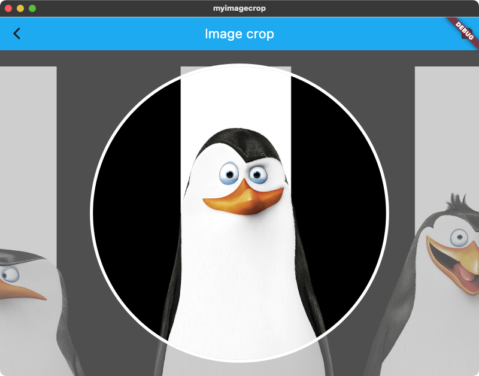

# Flutter Crop View

A simple view to allow user specifying a boundary on the target view (most common case is cropping image for avatar).

This widget is made by Flutter widgets, so it can be used on platforms that Flutter can run.

## Features



- The crop window is fixed.
- User can zoom in/out the target view, rotate, move around to fill the target view into the crop window.
  - To move on Desktop/Web: drag mouse.
  - To move on Phone: drag (pan) with 1 finger.
  - To zoom on Desktop/Web: use mouse scroll.
  - To zoom on Phone: use 2 fingers to pinch and stretch.
  - To rotate on Desktop/Web: long press with mouse button and drag around the center of the view.
  - To rotate on Phone: use 2 fingers to rotate (or long press and pan around like on Desktop/Web).
- The result is the rotation angle (radian) and the frame (coordinates - after rotation) of the boundary on normal size of target view.

## Usage

- First, you need `CropViewAdapter` to control (get result from) the crop view.
```
class YourScreenState extends State<YourScreenWidget> {
    final CropViewAdapter _adapter = CropViewAdapter(calculateCropWindow: (Size bounds) => Rect(...));
...
```
- Parameters for `CropViewAdapter`:
  - `calculateCropWindow`: a function block to specify the **display coordinates** of the crop window of given `bounds` area.
  - `maxScale`: how many **times of crop window size** that user can zoom in the target view.
  - `doubleTapMode`: double tap handle mode.
- In your `build` function:
```
Widget build(BuildContext context) {
    return YourWidgetContainer(
        child: CropView(
            adapter: _adapter,
            originWidth: <original width of target view/image>,
            originHeight: <original height of target view/image>,
            mask: <mask widget>,
            child: FittedBox(fit: BoxFit.fill, child: Image(...))
        )
    );
}
```
- Parameters:
  - `adapter`: `CropViewAdater`.
  - `originWidth`, `originHeight`: original size of target view / image.
  - `mask`: a widget to display as crop window.
  - `child`: your target view / image.

> `CropView` layout is about below:
>```
> Stack(
>   InteractiveViewer(
>     SizedBox(
>       YourTargetView
>     )
>   ),
>   MaskView
> )
>```
>
> The `SizedBox` size will be changed following user zooming. So make sure your target view responsive (as example above, put your `Image` inside `FittedBox`).
- Mask view: widget to display the crop window. You can make your own widget or use the simple `CropMaskView(painter: _painter)`, which `_painter` is a `CropMaskPainter extends CustomPainter`, supporting drawing 2 shapes (rectangle / oval) of crop window with or without border at the center of widget.
- To get crop frame, use `CropViewAdapter.getCropFrame()`:
```
(double, Rect) result = _adapter.getCropFrame();
// Convert `result.$1` from radian to degree, use in function `copyRotate` of `package:image` to rotate image (ofcourse, we can ignore this step if rotation angple is 0 (no rotation)).
// Next, use `result.$2` in the function `copyCrop` to crop the (rotated) image.
```

**Full example to crop an image:**

```
import 'package:flutter/material.dart' as Ui;
import 'package:image/image.dart' as Img;

class YourScreenWidget {
  final Img.Image image; // Image to crop, from `package:image`

  const YourScreenWidget({super.key, required this.image});

  ...
}

class YourScreenState extends State<YourScreenWidget> {

  final CropMaskPainter _maskPainter = const CropMaskPainter(shape: CropMaskShape.oval, shapeRatio: 1, cropWindowBorder: 5); // Crop window is a circle with 5 points border
  late CropViewAdapter _adapter;

  @override
  void initState() {
    super.initState();
    // Synch crop window coordinates method between crop view adapter and crop mask painter
    _adapter = CropViewAdapter(calculateCropWindow: (bounds) => _maskPainter.calculateCropWindow(bounds));
  }

  @override
  Widget build(BuildContext context) {
    return Scaffold(
      appBar: AppBar(
        actions: [
          IconButton(
            onPressed: _onSubmit,
            icon: const Icon(Icons.save),
          )
        ],
      ),
      body: CropView(
        adapter: _adapter,
        originWidth: widget.image.width.toDouble(),
        originHeight: widget.image.height.toDouble(),
        mask: CropMaskView(painter: _maskPainter),
        child: FittedBox(fit: BoxFit.fill, child: Ui.Image.memory(Img.encodeJpg(widget.image)))
      )
    );
  }

  void _onSubmit() {
    (double, Rect) result = _adapter.getCropFrame();
    Img.Image image = widget.image;
    if (result.$1 != 0) {
      image = Img.copyRotate(image, angle: degrees(result.$1));
    }
    Rect cropFrame = result.$2;
    Img.Image croppedImage = Img.copyCrop(
        image,
        x: cropFrame.left.toInt(),
        y: cropFrame.top.toInt(),
        width: cropFrame.width.toInt(),
        height: cropFrame.height.toInt()
    );
  }

}
```

## Version and branches:

- Version `0.x.x`: basic crop view, no rotation (source code is more simple). Source branch: `versions/0.0.1`.
- Version `1.x.x`: add feature of rotation. Source branch: `versions/1.0.1`
- Branch `develop`: lastest source code.
